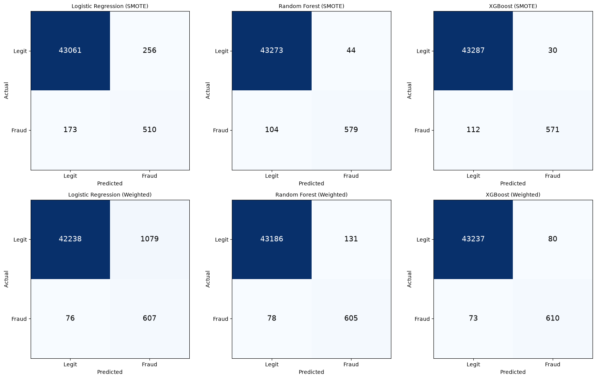

# Fraud Detection Engine

An end-to-end machine learning pipeline for transaction fraud scoring. It covers synthetic data generation, causal feature engineering, a comparison of two imbalance-handling strategies across three model families, and a fraud scoring API that returns an **ALLOW / REVIEW / BLOCK** decision.

```
Transaction → Feature Engineering → ML Model → Fraud Probability → Risk Classification → ALLOW / REVIEW / BLOCK
```

## Highlights

- **220,000 transactions** across 4,000 customers with a realistic **~1.5% fraud rate**
- **20 engineered features**, all computed causally (past data only) to prevent leakage
- **6 models trained and compared**: Logistic Regression, Random Forest and XGBoost, each with SMOTE and with class weighting
- **Time-based evaluation**: train on the earliest 80% of transactions, test on the most recent 20%
- **Best model: XGBoost + SMOTE**, with PR-AUC 0.947, 95.0% precision and 83.6% recall
- **Fraud scoring API** that turns a raw transaction into a probability and a business decision

## Dataset

No real labeled fraud data was available, so the notebook generates a synthetic dataset.

| Property | Value |
|---|---|
| Transactions | 220,000 |
| Customers | 4,000 |
| Fraud rate | ~1.5% |
| Fields | transaction_id, customer_id, amount, timestamp, merchant_category, latitude/longitude, device, previous_transaction_amount |

The first version of the generator made fraud almost perfectly separable, which gave unrealistic scores (PR-AUC ≈ 1.00). It was revised so that about 30% of fraud mimics normal behavior, and some legitimate customers transact at night, use high-risk merchants or make large one-off purchases. This produces a harder and more credible problem.

## Feature Engineering

- **Velocity**: rolling transaction counts per customer over the last 1 hour and 24 hours
- **Spending deviation**: z-score of the amount against the customer's expanding historical mean and std
- **Amount ratio** to the previous transaction
- **Time anomalies**: odd-hour (12am–5am) and weekend flags
- **Rapid transaction flag**: under 60 seconds since the customer's last transaction
- **Distance** from the previous transaction (haversine)
- **Merchant risk**: high-risk category flag (crypto, gambling, wire transfer, jewelry) and first-time-category flag
- **Device change flag**

## Results

Evaluated on a held-out, time-based test split. Accuracy was deliberately not used, because a model that predicts "never fraud" scores 98.5% at this fraud rate. PR-AUC is the primary ranking metric.

| Model | Approach | Precision | Recall | F1 | PR-AUC |
|---|---|---|---|---|---|
| **XGBoost** | **SMOTE** | **0.950** | **0.836** | **0.889** | **0.947** |
| XGBoost | Class Weights | 0.884 | 0.893 | 0.889 | 0.946 |
| Random Forest | SMOTE | 0.929 | 0.848 | 0.887 | 0.945 |
| Random Forest | Class Weights | 0.822 | 0.886 | 0.853 | 0.938 |
| Logistic Regression | SMOTE | 0.666 | 0.747 | 0.704 | 0.793 |
| Logistic Regression | Class Weights | 0.360 | 0.889 | 0.512 | 0.739 |



**Takeaways**

- SMOTE and class weighting produce different precision/recall trade-offs. SMOTE gives fewer false alarms, while class weighting catches more fraud at the cost of more manual reviews.
- Tree-based models clearly outperform Logistic Regression, which can't capture the nonlinear feature interactions.

## Fraud Scoring API

The winning model (XGBoost + SMOTE) is wrapped in a `FraudScoringAPI` class. It accepts a raw transaction dictionary, engineers features on the fly from a per-customer history snapshot, and returns a fraud probability with a decision.

| Decision | Condition |
|---|---|
| **BLOCK** | probability ≥ 0.85 |
| **REVIEW** | probability ≥ 0.40 |
| **ALLOW** | probability < 0.40 |

Thresholds are configurable to match a business's risk tolerance and review-team capacity.

**Sanity check:** a $45 grocery purchase scored 0.0 (ALLOW), while a $4,500 crypto-exchange transaction at 3:12am from an unfamiliar location scored 0.9999 (BLOCK).

## Repository Structure

```
fraud-detection-engine/
├── FraudDetection.ipynb                 # Full pipeline: data, features, training, evaluation, API
├── Fraud_Detection_Engine_Report.docx   # Written project report
├── confusion_matrices.png               # Confusion matrices for all 6 models
├── models/
│   ├── fraud_model_xgb_smote.pkl        # Trained XGBoost (SMOTE) model
│   └── fraud_scaler.pkl                 # Fitted StandardScaler
└── README.md
```

## Getting Started

```bash
git clone https://github.com/<your-username>/fraud-detection-engine.git
cd fraud-detection-engine
pip install numpy pandas scikit-learn imbalanced-learn xgboost matplotlib joblib jupyter
jupyter notebook FraudDetection.ipynb
```

Run the notebook top to bottom. It generates the data, builds the features, trains all six models and produces the evaluation outputs.

To load the saved model and scaler:

```python
import joblib

model = joblib.load("models/fraud_model_xgb_smote.pkl")
scaler = joblib.load("models/fraud_scaler.pkl")
```

## Tech Stack

Python, pandas, NumPy, scikit-learn, imbalanced-learn (SMOTE), XGBoost, Matplotlib, joblib

## Limitations

- The data is synthetic, so the scores show the pipeline working end to end and are not a claim about real-world performance.
- The scoring API relies on a per-customer history snapshot. A production system would need a real-time feature store.

## Author

**Buchi** — Data Analyst/Scientist
